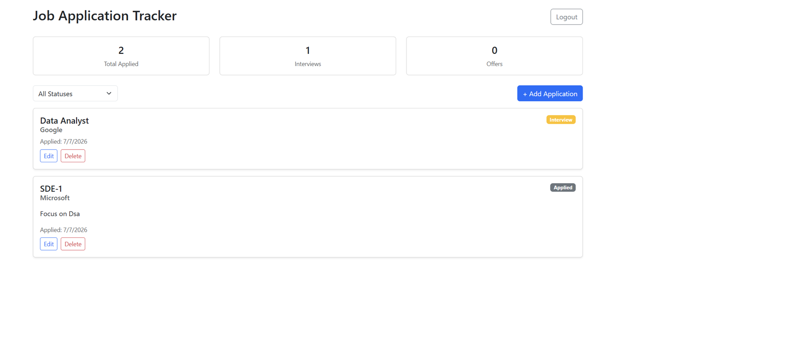

# Job Application Tracker

A full-stack MERN app for tracking job applications during placement season — built to solve my own real problem of juggling multiple applications, interview stages, and follow-ups across companies.

🔗 **Live App:** _add your Vercel URL here once deployed_
🔗 **Live API:** _add your Render URL here once deployed_



---

## Why I Built This

While applying to internships and placement drives, I kept losing track of which company I'd applied to, what round I was in, and when. Spreadsheets got messy fast. So I built a proper full-stack tracker with real authentication, a cloud database, and automated email notifications — treating my own job search like a real engineering problem instead of a to-do list.

## Features

- 🔐 Secure authentication with JWT and bcrypt password hashing
- 📋 Full CRUD for job applications (create, read, update, delete)
- 🔍 Filter applications by status (Applied, OA, Interview, Offer, Rejected)
- 📧 Automated, personalized confirmation emails on every new application (Nodemailer + Gmail SMTP)
- 📊 At-a-glance dashboard stats (total applied, interviews, offers)
- 🔒 User-scoped data — every user only ever sees their own applications
- 🎨 Clean, responsive UI with Bootstrap

## Tech Stack

| Layer | Technology |
|---|---|
| Frontend | React 18 (Vite), React Router, Axios, Bootstrap 5 |
| Backend | Node.js, Express.js |
| Database | MongoDB Atlas (Mongoose ODM) |
| Auth | JWT, bcryptjs |
| Email | Nodemailer (Gmail SMTP) |
| Hosting | Vercel (frontend) · Render (backend) |

## Project Structure

```
job-tracker/
├── backend/
│   ├── models/          → User, Application schemas
│   ├── routes/          → auth & application routes
│   ├── middleware/       → JWT auth middleware
│   ├── utils/            → email sending logic
│   └── server.js
└── frontend/
    └── src/
        ├── api.js         → Axios instance with JWT auto-attach
        ├── App.jsx         → Routes + protected route logic
        ├── pages/          → Login, Register, Dashboard
        └── components/     → ApplicationCard, ApplicationForm
```

## API Endpoints

### Auth
| Method | Endpoint | Description |
|---|---|---|
| POST | `/api/auth/register` | Create a new user account |
| POST | `/api/auth/login` | Log in and receive a JWT token |

### Applications (require `Authorization: Bearer <token>`)
| Method | Endpoint | Description |
|---|---|---|
| GET | `/api/applications` | Get all applications for the logged-in user |
| GET | `/api/applications?status=Interview` | Filter by status |
| POST | `/api/applications` | Create a new application |
| PUT | `/api/applications/:id` | Update an application |
| DELETE | `/api/applications/:id` | Delete an application |

## Data Model

```
User
├── name
├── email (unique)
└── password (hashed)

Application
├── userId (ref → User)
├── company
├── role
├── status (Applied | OA | Interview | Offer | Rejected)
├── appliedDate
├── link (optional)
└── notes (optional)
```

## Running Locally

### Backend
```
cd backend
npm install
```
Create a `.env` file in `backend/` with:
```
MONGO_URI=your_mongodb_connection_string
JWT_SECRET=your_jwt_secret
PORT=5000
EMAIL_USER=your_gmail_address
EMAIL_PASS=your_gmail_app_password
```
Then run:
```
node server.js
```
Backend runs on `http://localhost:5000`.

### Frontend
```
cd frontend
npm install
npm run dev
```
Frontend runs on `http://localhost:5173`.

## What I Learned

Building this taught me how authentication actually works end-to-end (not just using a library blindly), how to design a REST API with proper user-scoped data isolation, and how to debug real production issues — DNS resolution failures with MongoDB's SRV lookups, URL-encoding special characters in connection strings, and configuring SMTP credentials securely for automated email delivery.

## Author

**Amandeep Singh (Aman)**
B.Tech CSE, GTBIT, Delhi
[LinkedIn](https://www.linkedin.com/in/amandeep-singh712) · [GitHub](https://github.com/aman7757)
